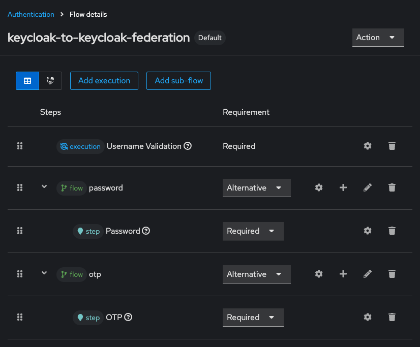

# Keycloak-to-Keycloak Federation

> A custom [User Storage SPI](https://www.keycloak.org/docs/latest/server_development/index.html#_user-storage-spi) implementation which enables Keycloak-to-Keycloak federation.

## Installation

Download the jar file from the latest release or action run and place it into Keycloak's providers directory.

See [the Keycloak documentation](https://www.keycloak.org/server/configuration-provider#_installing_and_uninstalling_a_provider) for reference.

## Configuration

### Remote Keycloak

Create an *OpenID Connect* type client with a name of your choice (e.g. `realm-user-query`).

1. Turn on **Client authentication** for confidential access
2. Enable **Direct access grants**
3. Enable **Service account roles**
4. Disable any other authentication flows
5. Assign the roles `view-users` and `query-users` at the *Service account roles* tab
6. Copy the **Client Secret** from the *Credentials* tab

Create a custom *Direct grant authentication flow* with the following structure:

**Bind** this flow as the default for **Direct grant flow**

### Federation Keycloak

In a realm you want to enable federation for, go to *User federation* and add a new *Keycloak* provider.

Fill out the form and you're done! *Keycloak-to-Keycloak federation* is now enabled.

You probably want to disable *Required actions* such as **Update Password** and **Configure OTP** to avoid
problems when signing in.

## Supported credentials

Keycloak-to-Keycloak federation supports **password** and **OTP** type credentials.

Passkeys need to be configured separately by the user.

## Supported Keycloak versions

I usually test against the Keycloak version I'm using myself.

Consider the latest major release as generally supported which is **26** at the time of writing.

## License

[Apache-2.0](LICENSE)
